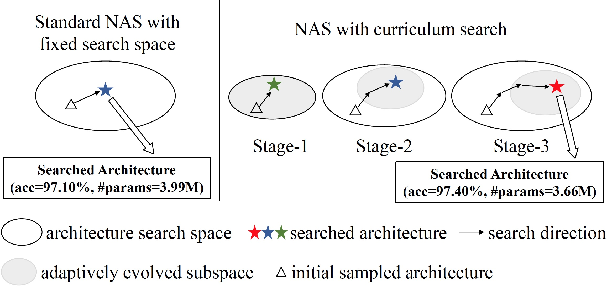

# Curriculum Neural Architecture Search with Progressively Growing Search Space

Pytorch implementation for "[Curriculum Neural Architecture Search with Progressively Growing Search Space](https://proceedings.icml.cc/static/paper_files/icml/2020/248-Paper.pdf)".

<p align="center">

</p>

## Requirements

```
python>=3.7, torch==1.5.0, torchvision==0.6.0, graphviz
```

Please install all the requirements in `requirements.txt`.

## Datasets

We consider two benchmark classification datsets, including CIFAR-10 and ImageNet.

CIFAR-10 can be automatically downloaded by torchvision.

ImageNet needs to be manually downloaded (preferably to a SSD) following the instructions [here](https://github.com/pytorch/examples/tree/master/imagenet).

## Training Method

Curriculum search on CIFAR-10

```
python search.py -o outputs/search
```

## Evaluation Method

1. Put the searched architectures in `cnas/model/genotypes.py` as follows.

```
CNAS = Genotype.from_arch(
    normal_arch=[('dil_conv_3x3', 1, 2),
                 ('sep_conv_3x3', 0, 2),
                 ('sep_conv_3x3', 0, 3),
                 ('skip_connect', 1, 3),
                 ('sep_conv_3x3', 1, 4),
                 ('max_pool_3x3', 3, 4),
                 ('sep_conv_3x3', 2, 5),
                 ('sep_conv_3x3', 4, 5)],
    normal_concat=[2, 3, 4, 5],
    reduced_arch=[('sep_conv_3x3', 0, 2),
                  ('skip_connect', 1, 2),
                  ('dil_conv_5x5', 2, 3),
                  ('skip_connect', 1, 3),
                  ('dil_conv_3x3', 2, 4),
                  ('sep_conv_3x3', 1, 4),
                  ('sep_conv_5x5', 0, 5),
                  ('sep_conv_3x3', 3, 5)],
    reduced_concat=[2, 3, 4, 5])
```

2. Evaluate the searched architecture on CIFAR-10 and ImageNet dataset using the following scripts.

Evaluation on CIFAR-10:
```
CUDA_VISIBLE_DEVICES=0,1 python -m torch.distributed.launch \
--nproc_per_node=2 --master_port=23333 \
eval_arch.py \
--arch CNAS --init_channels 36 --layers 20 \
-o outputs/cifar10
```

Evaluation on ImageNet:
```
CUDA_VISIBLE_DEVICES=0,1,2,3 python -m torch.distributed.launch \
--nproc_per_node=4 --master_port=22333 \
eval_arch.py \
--max_epochs 250 --scheduler linear \
--dataset imagenet --data /path/to/imagenet \
--batch_size 64 --no_bias_decay --num_workers 8 \
--arch CNAS --init_channels 48 --layers 14 \
-o outputs/imagenet
```

## Pretrained models

We have released our CNAS ImageNet pretrained model (top-1 accuracy 75.4%, top-5 accuracy 92.6%) on [here](https://github.com/guoyongcs/CNAS/releases/tag/models).

You can use the following codes to load the ptrained models:

```
from cnas.model.eval import cnas_imagenet
model = cnas_imagenet(pretrained=True)
```

## Citation

If you use any part of our code in your research, please cite our paper:

```
@InProceedings{guo2020breaking,
  title = {Breaking the Curse of Space Explosion: Towards Efficient NAS with Curriculum Search},
  author = {Guo, Yong and Chen, Yaofo and Zheng, Yin and Zhao, Peilin and Chen, Jian and Huang, Junzhou and Tan, Mingkui},
  booktitle = {Proceedings of the 37th International Conference on Machine Learning},
  year = {2020}
}
```
